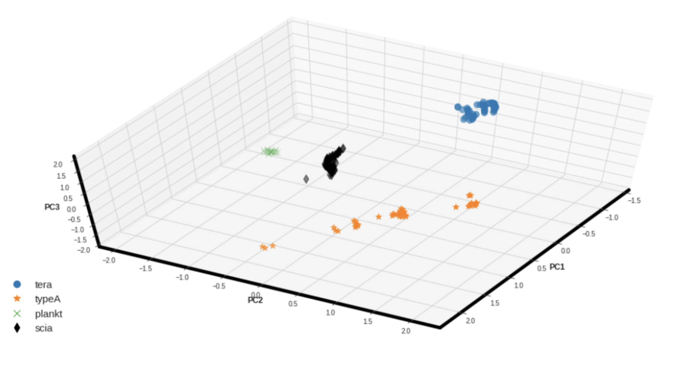
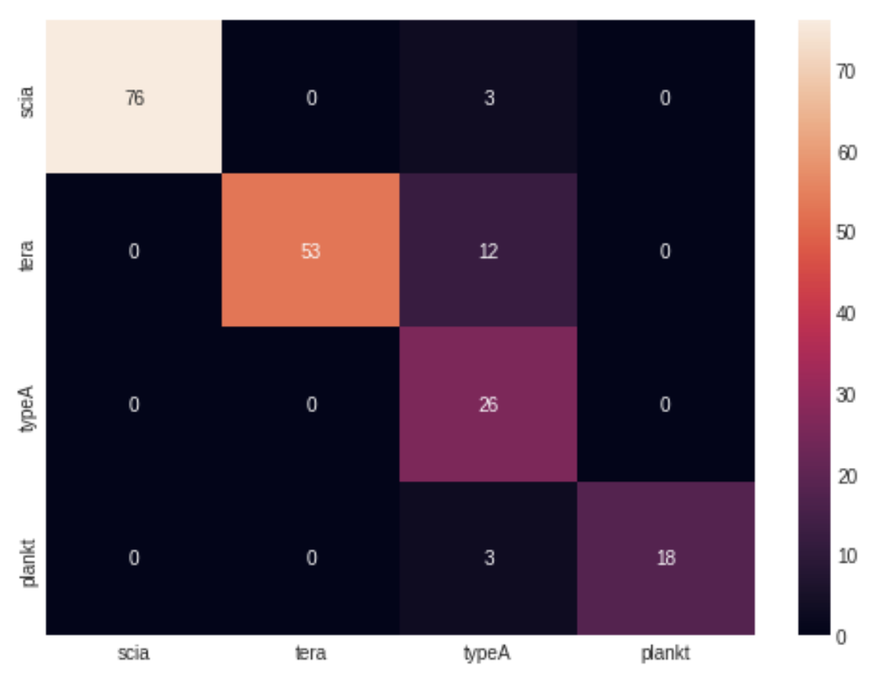

# Fish Classification Using Signal Data with PCA and K-Means

This repository presents an unsupervised learning approach for classifying fish species based on signal data. Principal Component Analysis (PCA) and K-Means clustering are leveraged to achieve dimensionality reduction and clustering, respectively.

## Project Overview

The project utilizes signal data representing fish characteristics and applies unsupervised learning techniques to identify and classify fish into distinct groups. This approach helps uncover patterns and insights in the data without requiring labeled samples.

## Features

- **Data Preprocessing**: Signal data is preprocessed for normalization and removal of noise to ensure optimal model performance.
- **Dimensionality Reduction**: PCA is employed to reduce the high-dimensional signal data into lower-dimensional components, retaining significant variance.
- **Clustering**: K-Means is used to cluster fish data into groups, aiding in classification based on signal characteristics.
- **Visualization**: Results are visualized in a 2D/3D space to illustrate clustering and group separation.

## File Structure

```
fish-classification/
│
├── data/                      # Folder containing signal data                
│   fishClasification.ipynb    # K-Means clustering implementation. Jupyter notebooks for step-by-step implementation
├── requirements.txt           # Dependencies for the project
├── README.md                  # Project documentation
└── LICENSE                    # License information
```

## How to Use

1. **Clone the Repository**:
   ```bash
   git clone https://github.com/yourusername/fishSignals.git
   cd fishSignals
   ```

2. **Install Dependencies**:
   ```bash
   pip install -r requirements.txt
   ```

3. **Run the Notebooks**:
   - Use `fishClasification.ipynb` for PCA analysis and visualization and K-Means clustering and results.

4. **Analyze Results**:
   - Check the visualizations for group separations and evaluate clustering quality.

## Dependencies

- Python 3.x
- NumPy
- Pandas
- Scikit-Learn
- Matplotlib
- Seaborn

## Results

- PCA reduces signal data dimensionality, enabling effective clustering.
- K-Means groups fish based on distinct signal patterns, providing meaningful classifications.

  
  

## Contributions

Contributions are welcome! Fork the repository, make your improvements, and submit a pull request.

## License

This project is licensed under the MIT License. See the `LICENSE` file for details.

